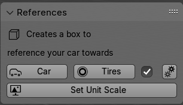
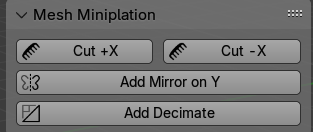
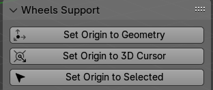
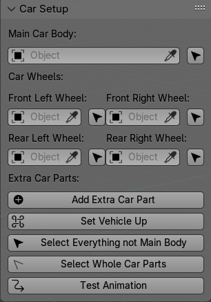
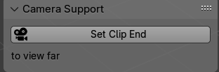
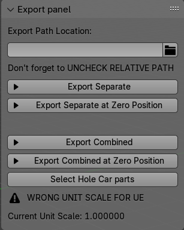
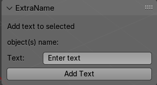
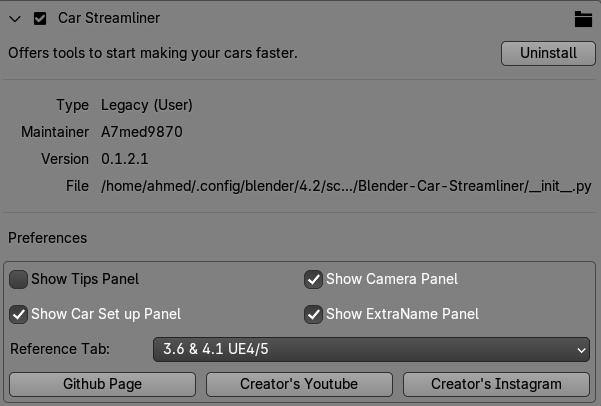

# Blender-Car-Streamliner

Blender-Car-Streamliner is a Blender addon designed to simplify the process of setting up cars for modfiying or exporting into Unreal Engine. Originally was a set of Blender scripts i used a ton, it has been converted into an addon for easier use and is public so anyone can benfit from.

## Features

- **References Box**: Provides a references box for your vehicle (currently only for Unreal Engine).

- **Cut and Mirror**: Allows for easy cutting and mirroring with just 2 clicks, especially useful for exterior modeling.

- **Origin Manipulation**: Helps beginners manipulate the origin of objects.

- **Car Parenting Setup**: Sets up car parenting (for Unreal Engine) with the ability to add custom parts.

- **Camera Far Clip Adjustment**: Adjusts the camera far clip for large objects being moved into Unreal Engine; by default it's off.

- **Exporting with Options**: Allows exporting with the option to move everything to 0,0,0, useful for aligning models for export.

- **Add End Names**: Includes a text input box for adding end names; by default it's off as it's basic at the moment.

- **Options on perfernces**: If there is something you don't like, you propbebly can disable it on this menu, as well options for older menus support.

## Plans For Future

- **Document Ops**: Display information about button functions when hovering the mouse over them.
- **Error Messages**: Include error messages for missing functionalities.
- **Optional Panels**: Add optional panels for setting up cars for NFS BB modding.

## Contributing
- **Feel free to fork**: this repository. Don't need or have to contact me beforehand. I do appreciate any Contributions and criticisms; as well any suggestions
